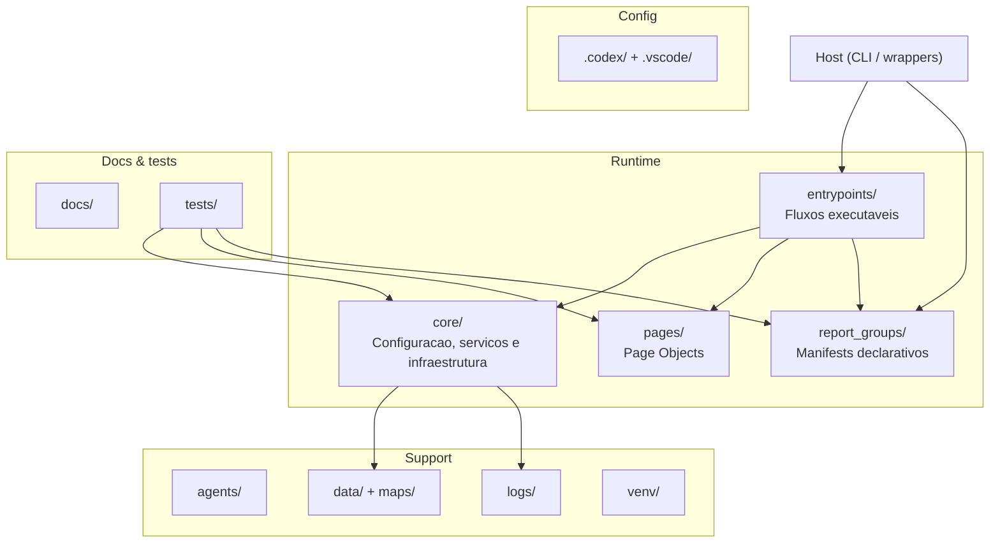

# Promax Web Driver

Automacao RPA em Python para o sistema legado Promax, com Selenium em Edge IE Mode, arquitetura Page Object Model e servicos de download, publicacao e rastreio de execucao.

## Visao Geral

Este repositorio centraliza fluxos operacionais de:

- geracao de relatorios;
- digitacao de pedidos;
- alteracao em lote de condicao/CEMC;
- reprocessamento de publicacoes pendentes.

O projeto prioriza estabilidade operacional em ambiente legado (frames, alertas assincronos, postbacks e UI nativa de download).

## Sumario

- [Arquitetura](#arquitetura)
- [Fluxos Disponiveis](#fluxos-disponiveis)
- [Execucao Rapida](#execucao-rapida)
- [Configuracao](#configuracao)
- [Compatibilidade](#compatibilidade)
- [Documentacao](#documentacao)

## Arquitetura

```
promax-web-driver/
|-- entrypoints/   # fluxos executaveis reais
|-- core/          # infraestrutura e servicos compartilhados
|-- pages/         # page objects (common, auth, reports, processes)
|-- report_groups/ # manifests declarativos dos grupos de relatorios
|-- tests/         # testes unitarios e de contrato
|-- docs/          # contexto tecnico e historico
`-- agents/        # prompts de agentes especializados
```

Referencias internas:

- `entrypoints/README.md`
- `core/README.md`
- `pages/README.md`
- `tests/README.md`

## Fluxos Disponiveis

| Comando CLI                              | Entrada real                                          | Objetivo                            |
| ---------------------------------------- | ----------------------------------------------------- | ----------------------------------- |
| `python cli.py relatorios`             | `entrypoints/reports/relatorios.py`                 | Fluxo de caixa (grupo padrao)       |
| `python cli.py relatorios --perfil giro` | `entrypoints/reports/relatorios.py`                | Executa um grupo dinamico           |
| `python cli.py catalogo-relatorios`    | `report_groups/*.py`                                | Exibe o catalogo JSON sem Selenium  |
| `python cli.py fechamento`             | `entrypoints/reports/relatorios_fechamento.py`      | Fluxo de fechamento                 |
| `python cli.py repescagem`             | `entrypoints/reports/repescagem_relatorios.py`      | Repescagem manual de relatorios     |
| `python cli.py reprocessar-publicacao` | `entrypoints/maintenance/reprocessar_publicacao.py` | Reprocessa pendencias de publicacao |
| `python cli.py pedidos`                | `entrypoints/processes/pedidos.py`                  | Digitacao de pedidos                |
| `python cli.py lote-condicao`          | `entrypoints/processes/lote_condicao.py`            | Alteracao em lote de condicao/CEMC  |

## Execucao Rapida

### 1) Preparar ambiente

```bash
python -m venv venv
venv\Scripts\activate
pip install -r requirements.txt
```

### 2) Configurar variaveis

Defina o arquivo `.env` conforme esperado em `core/config/settings.py`.

### 3) Configurar o Internet Explorer / IE Mode

Para o fluxo de download funcionar corretamente, execute o comando abaixo no Windows:

```bat
reg add "HKCU\Software\Microsoft\Internet Explorer\Main" /v TabProcGrowth /t REG_DWORD /d 0 /f
```

### 4) Executar um fluxo

```bash
python cli.py relatorios
```

Para escolher um grupo e limitar as rotinas:

```bash
python cli.py relatorios --grupo outros --rotinas 020220_AUDITOOL 020220_RECOLHAS
```

Os grupos disponiveis sao `inadimplencia`, `obz`, `adf`, `outros`, `giro`,
`estoque`, `fluxo_caixa` e `bot_zap`. Consulte o contrato completo com:

```bash
python cli.py catalogo-relatorios
```

Cada arquivo em `report_groups/` contem somente uma atribuicao literal
`REPORT_GROUP`, com `key`, `name`, `description` e a lista de rotinas. O loader
usa `ast.parse` e `ast.literal_eval`; os manifests nao sao importados nem
executados.

## Configuracao

O projeto le configuracoes centralmente por `core/config/settings.py`.

Pontos operacionais importantes:

- `DOWNLOAD_DIR` e pasta intermediaria de captura;
- a publicacao final segue o `PublicationPlan` definido por entrypoint;
- o ambiente esperado e Windows com Edge IE Mode, desktop interativo e acesso a compartilhamentos de rede.

## Compatibilidade

Os scripts da raiz foram preservados para chamadas antigas, mas hoje funcionam como wrappers:

- `main.py`
- `mainRelatorios.py`
- `mainRelatoriosFechamento.py`
- `mainPedidos.py`
- `mainReprocessarPublicacao.py`
- `main140510.py`
- `mainAdf.py`
- `mainBotZap.py`
- `mainEstoque.py`
- `mainFluxoCaixa.py`
- `mainGiro.py`
- `mainInadimplencia.py`
- `mainObz.py`
- `mainOutros.py`
- `alterarCEMC.py`

Para novos usos, prefira sempre `cli.py` e `entrypoints/`.

## Documentacao

- `report_groups/README.md`
- `docs/PROJECT_CONTEXT.md`
- `docs/code_review_tecnico.md`
- `docs/ATUALIZACOES_2026-03-23.md`
- `docs/plano_elevacao_nota_rpa.md`
- `docs/status_plano_melhoria.md`

## Notas de Operacao

O comportamento do Promax exige cuidados especificos de automacao:

- troca frequente de frame apos postback;
- tratamento resiliente de alertas;
- uso de helpers de interacao via JS;
- fluxo de download com componentes de UI nativa em parte das rotinas.

<!-- repo-map:start -->
<!-- This block is regenerated by skills/repo-map. Do not hand-edit.    -->
<!-- Re-run /repo-map to refresh after directory structure changes.     -->

<!-- repo-map:end -->